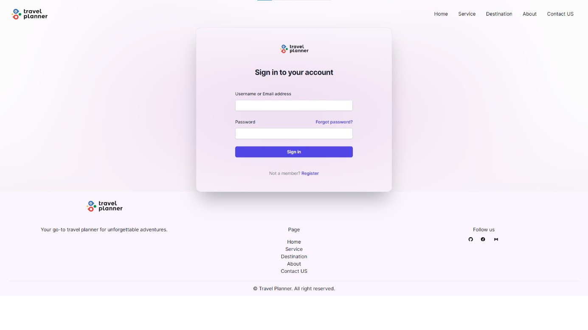
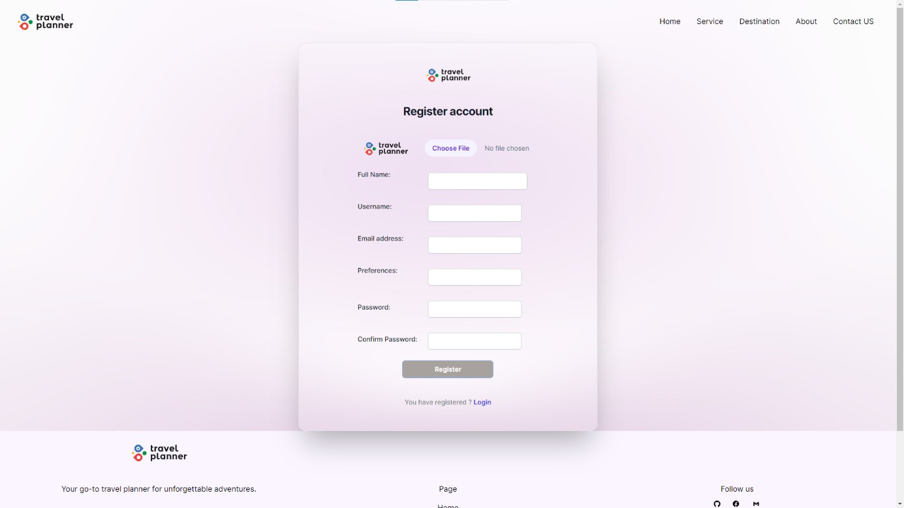
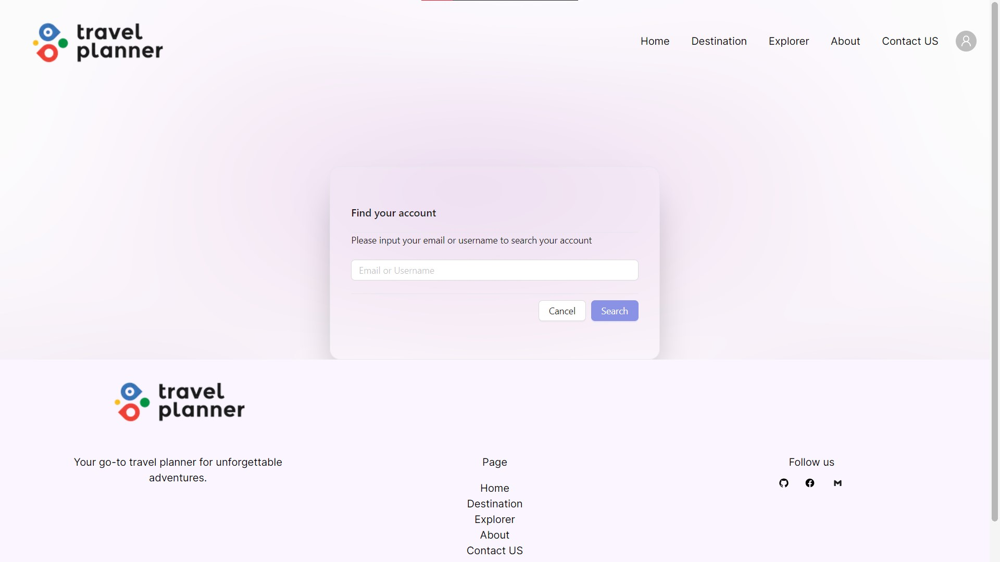
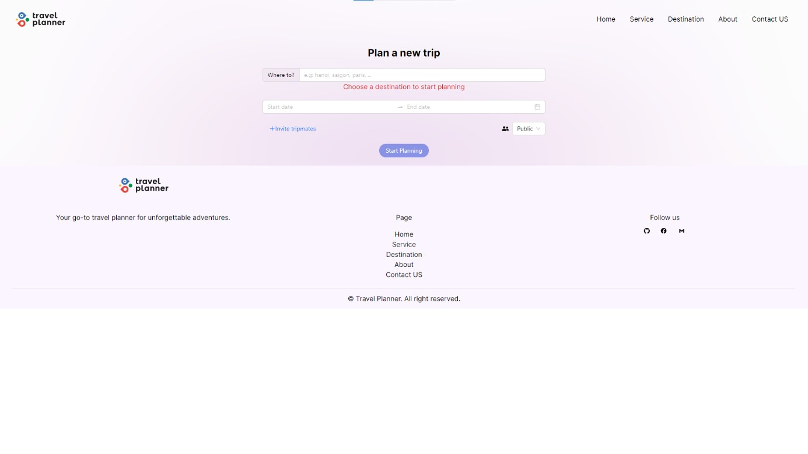
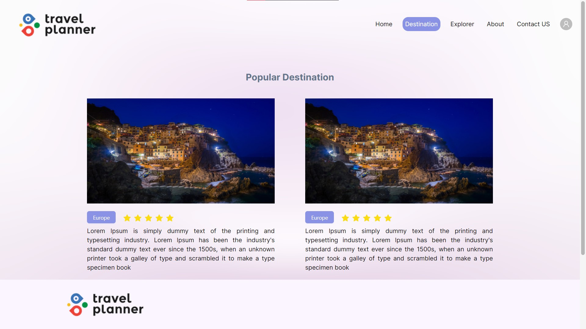
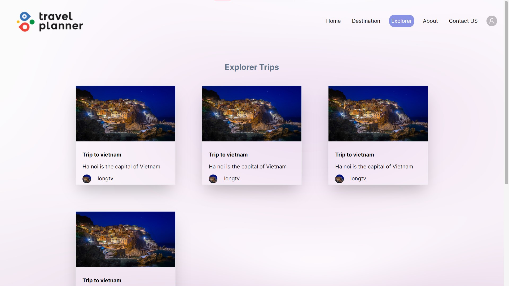
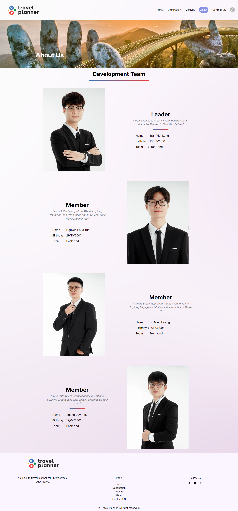
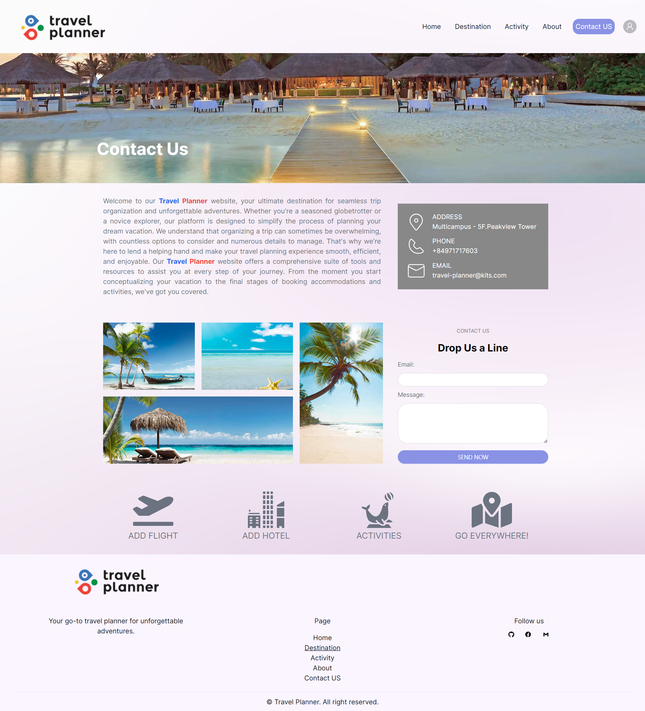

Repository:

<ul>
<li>
    <a href="https://github.com/KITS2023/Travel_Planner_FE.git">Front-end client</a>
<li>
    <a href="https://github.com/KITS2023/Travel_Planner_Admin.git">Front-end admin</a>
</li>
<li>
    <a href="https://github.com/KITS2023/Travel_Planner_BE.git">Backend</a>
</li>
<li>
    <a href="https://github.com/KITS2023/KITS2023_C6">Documents</a>
</li>
</ul>

Step 1: Clone project

```bash
git clone https://github.com/KITS2023/Travel_Planner_FE.git
```

Step 2: Install dependence and run
<br />1.
    ```
    npm i
    ```
     OR
    ```
    yarn
    ```
<br />2.
    ```
    npm run start
    ```
    OR 
    ```
    yarn start
    ```

Step 3: Run and explore app
<br />
Open [http://localhost:3000](http://localhost:3000) with your browser to see the result.

<br />

---

Deme theme
<br />
Auth





<br />
Landing Page


<br />
Plan Page




<br />
Destination Page




<br />
Explore Page




<br />
About Page




<br />
Contact Page



---
